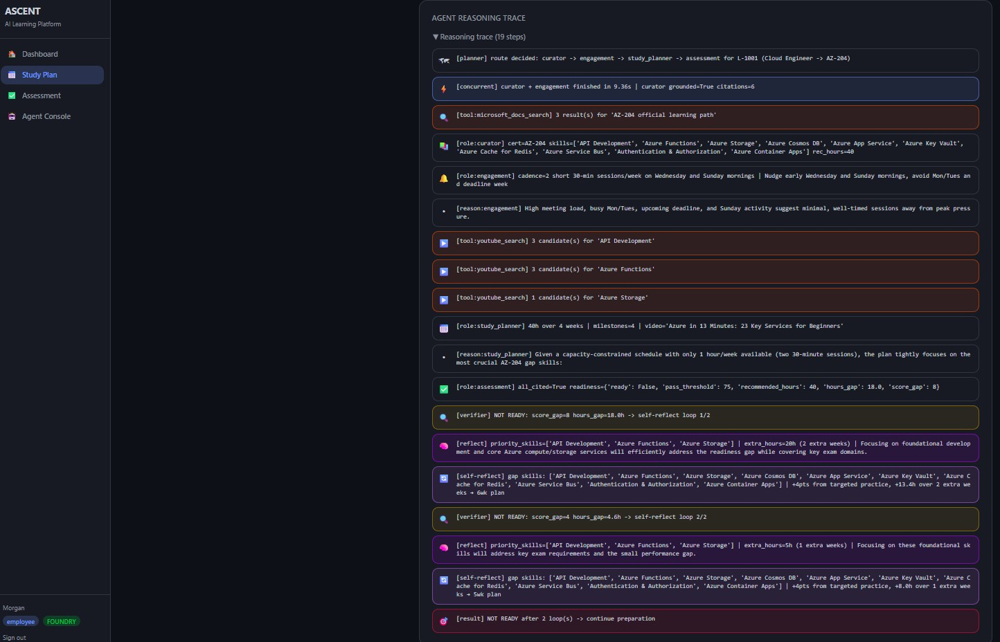
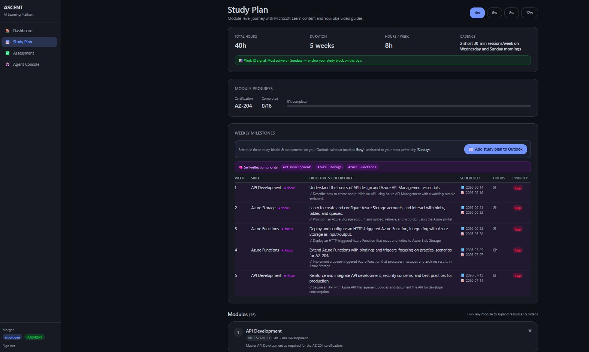
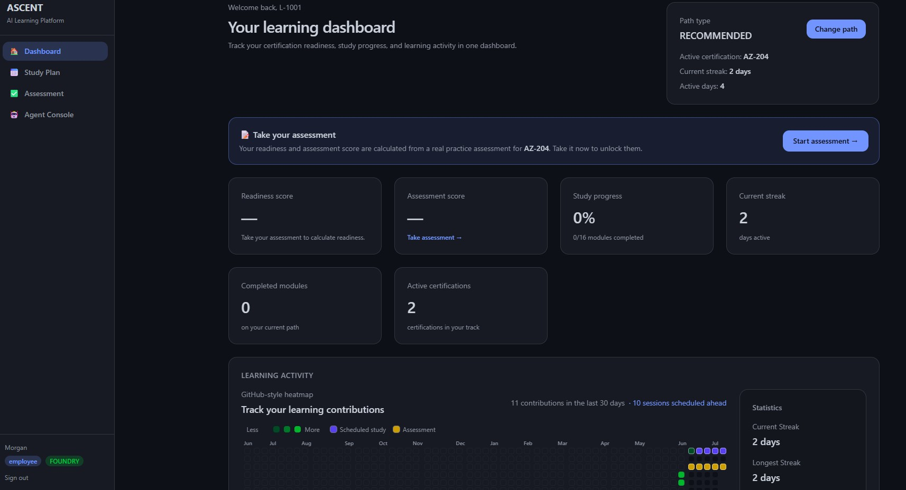
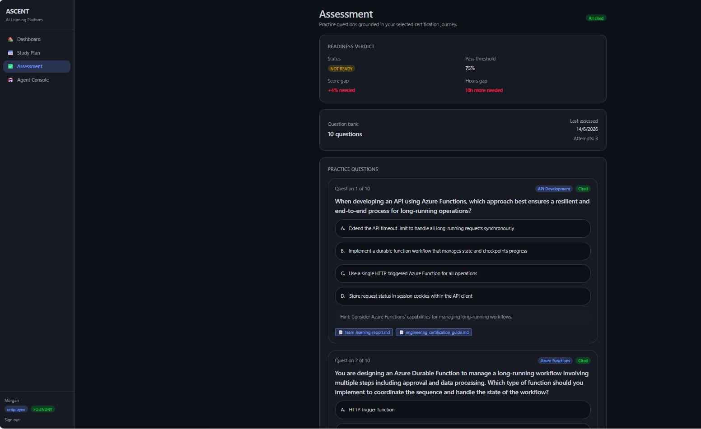
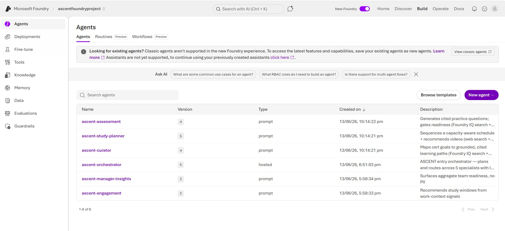

# ASCENT

**Adaptive Skills & Certification Enablement for Teams**
A multi-agent **enterprise learning system** for the Microsoft Agents League — *Reasoning Agents* track (Battle #2, Challenge A), built on **Microsoft Foundry** + the **Microsoft Agent Framework**.


> ⚠️ **All data and documents in this repository are SYNTHETIC and for demonstration only.** No real personal, customer, employee, or proprietary data is used. Identifiers such as `L-1001`, `EMP-001`, and `TEAM-A` are fabricated.

---

## Screens

| Agent reasoning trace | Study Plan (scheduled) |
|---|---|
| Planner→Executor route, tool calls (Microsoft Learn + YouTube), Critic/Verifier readiness gate, and the self-reflection loop. | Dynamic week-by-week milestones with objectives, **scheduled dates**, the Work IQ day anchor, and the *Add study plan to Outlook* button. |
|  |  |

| Dashboard + heatmap | Assessment (grounded) |
|---|---|
| Take-assessment prompt with readiness/score gated until taken, and the contribution heatmap with **scheduled study (purple) + assessment (amber)** overlay. | Grounded multiple-choice questions with **citation chips** and a readiness verdict (pass threshold, score/hours gap). |
|  |  |

**Registered in Microsoft Foundry** — the entry `ascent-orchestrator` (**hosted** agent) plus the five specialist **prompt** agents, each versioned and invokable by name.



---

## What it does

A learner picks a certification goal (a recommended path or a custom one such as **SC-200**). The system then:

1. **Curates** cited learning content for that goal and role — grounded in an approved knowledge base **and** official Microsoft Learn modules (**Foundry IQ** + **Microsoft Learn MCP**).
2. **Builds** a realistic, capacity-aware, week-by-week study plan (**Fabric IQ** semantic model + LLM milestone reasoning).
3. **Schedules** study blocks and assessment checkpoints on real dates, anchored to the learner's most active day (**Work IQ** signals + contribution heatmap) — and can push them to **Outlook** (Microsoft Graph) or export an `.ics`.
4. **Assesses** readiness with grounded, cited practice questions scoped to the chosen certification (**Foundry IQ** + **Fabric IQ**); the real score drives readiness.
5. **Loops or advances** — ready learners get the next step; others loop back via self-reflection.
6. **Surfaces** team-level readiness and risk to managers — without exposing PII.

---

## How this maps to the challenge

| Submission requirement | Where it lives |
|---|---|
| Multi-agent system aligned to Challenge A | Orchestrator + 5 specialists (`src/orchestrator.py`, `src/agents/`) |
| Microsoft Foundry (SDK) and/or Agent Framework | Foundry **prompt agents** + a **Hosted Agent** orchestrator (`azure-ai-projects`, `agent-framework`) |
| Reasoning & multi-step decision-making | Planner–Executor, Critic/Verifier, Self-reflection loop, role specialisation, agent-to-agent delegation |
| External tools / APIs / MCP that add real value | **Microsoft Learn MCP**, **Azure AI Search**, **Web Search**, **YouTube Data API**, **Microsoft Graph (Outlook)** |
| **At least one** Microsoft IQ layer | **All three**: Foundry IQ + Fabric IQ + Work IQ |
| Synthetic data only | `data/*.json`, `docs/*.md` — fabricated IDs throughout |
| Demoable + documented | Full React UI, Agent Console, reasoning trace, this README |
| Highly-valued extras | Evals (26 cases), OpenTelemetry, Responsible-AI guardrails, hosted deployment |

---

## Architecture

A top-level **Orchestrator** plans and routes to five specialist agents:

| Agent | Role | Foundry-native tools / grounding |
|---|---|---|
| Orchestrator | Plan → route → assemble → readiness gate | Agent Framework workflow (Hosted Agent) |
| Learning Path Curator | Cert → skills → cited content | **Azure AI Search** (Foundry IQ) + **Microsoft Learn MCP** |
| Study Plan Generator | Content → dated weekly schedule | Fabric IQ + **Microsoft Learn MCP** + **Web Search** |
| Engagement Agent | Study windows around work load | Work IQ |
| Assessment Agent | Cited questions + readiness score | **Azure AI Search** (Foundry IQ) + **Microsoft Learn MCP** |
| Manager Insights Agent | Team readiness + risk (no PII) | Fabric IQ + Work IQ |

### Orchestration flow

```
Orchestrator.plan_route()                # Planner–Executor: full route decided up front
    │
    ├─[parallel]──┬── Curator        Azure AI Search + Microsoft Learn (cited)
    │             └── Engagement     reads Work IQ signals + heatmap day-of-week
    │
    ├─[sequential]─── Study Planner  curator output + engagement window → dated milestones
    │
    └─[critic loop]── Assessment     cited MCQs → readiness gate
              │
              └── if NOT READY → self-reflect (gap-skill + hours reasoning) → re-plan (max 2 loops)
```

### Reasoning patterns

| Pattern | Implementation |
|---|---|
| **Planner–Executor** | `plan_route()` decides the full route before any specialist fires |
| **Role specialisation** | 5 bounded agents, each with one concern and its own system prompt |
| **Concurrent execution** | Curator + Engagement run in parallel via `ThreadPoolExecutor` |
| **Critic / Verifier** | Assessment refuses uncited output and enforces the pass threshold |
| **Self-reflection** | On fail: gap-skill analysis → LLM priority + extra-hours reasoning → re-plan |
| **Agent-to-agent delegation** | `ASCENT_DELEGATION=foundry` routes specialist reasoning to the registered Foundry sub-agents |

---

## The three Microsoft IQ layers

ASCENT integrates **all three** IQ intelligence layers, following the kit's suggested implementation patterns.

| Layer | File | How it's implemented |
|---|---|---|
| **Foundry IQ** | `src/iq/foundry_iq.py` | Grounded retrieval with **citations**. In `foundry` mode it queries **Azure AI Search**; locally it falls back to keyword search over `docs/*.md`. The Curator & Assessment Foundry agents also carry the Azure AI Search tool so they ground **server-side**. |
| **Fabric IQ** | `src/iq/fabric_iq.py` + `data/semantic_seed.json` | The **semantic layer / ontology**: entities and rules connecting `role → certification → skills → recommended_hours → prerequisites → advancement`, plus the readiness rule (`score ≥ 75 AND hours ≥ 90% of recommended`). Drives plan sequencing, skill-gap analysis, and readiness scoring. |
| **Work IQ** | `src/iq/work_iq.py` + `data/work_signals.json` | The **work-context layer**: meeting load, focus hours, preferred slot → study cadence + reminder policy. It also mines the **contribution heatmap** (`_dow_pattern`) to find each learner's most active day and anchor the schedule there. |

> Fabric IQ and Work IQ are modeled from **synthetic seeds** (not a live Fabric/M365 tenant) per the kit's "suggested implementation pattern" — the entities, relationships, and rules are explicit and reusable across planning, scoring, and manager insights. Foundry IQ uses a real Azure AI Search index when configured.

---

## Integrations

### 1. Microsoft Learn MCP (official, hosted)
The Curator, Study Planner, and Assessment **Foundry agents** each carry the public Microsoft Learn MCP server (`https://learn.microsoft.com/api/mcp`, type `mcp`, app-managed, **no key**). So a query like *"official SC-200 learning path"* returns real `learn.microsoft.com/training/paths/...` deep links, cited alongside the internal knowledge base — Azure AI Search is never the only source. The in-process Curator also calls the Microsoft Learn **search API** as a tool (`microsoft_docs_search` / `microsoft_docs_fetch` in `src/agents/tools.py`).

### 2. Foundry IQ / Azure AI Search (grounding + citations)
`src/iq/foundry_iq.py` performs agentic retrieval and returns `Citation` objects. The Assessment agent **refuses to emit a question without a citation** (Critic/Verifier). Connection uses the project's Azure AI Search connection; auth is the agent's managed identity (or API key in `.env`). Local mode grounds in `docs/*.md` so the app always runs.

### 3. YouTube video recommendations (per module, quota-resilient)
Every study module shows a real, skill-specific tutorial video. The resolver (`_yt_for_skill` in `api/routes_employee.py`) uses a **four-tier fallback** so a video always appears regardless of API quota:

1. **YouTube Data API v3** — freshest, skill-specific (when `YOUTUBE_API_KEY` is set and quota remains).
2. **YouTube search-page scrape** — real, skill-specific video, **no key / no quota**.
3. **Curated map** — hand-picked, offline-safe videos for common skills.
4. **Per-certification overview video** — an oEmbed-verified fallback so a module never shows an empty tile.

Setup (optional): get a free key at <https://console.developers.google.com/> and set `YOUTUBE_API_KEY` in `.env`. Without it, tiers 2–4 still deliver real videos. Module-level Microsoft Learn **deep links** (module / docs / lab) are fetched per skill from the Learn search API and cached.

### 4. Outlook calendar (Microsoft Graph, cross-tenant) — see full setup below
A **"📅 Add study plan to Outlook"** button writes the dated study blocks + assessment checkpoints as calendar events (marked **Busy**) to a mailbox in a **separate** Azure AD tenant, with an `.ics` download fallback when unconfigured.

### 5. Telemetry
`azure-monitor-opentelemetry` emits OpenTelemetry traces (auto-injected connection string in Hosted Agents) so the agent-to-agent flow is observable. The UI also renders a step-by-step **reasoning trace** for every run.

---

## Dynamic, path-aware behaviour

- **Single source of truth:** the chosen certification (e.g. **SC-200**) drives the Curator, Study Plan, modules, deep links, **and** Assessment — pick a path and everything re-derives from it.
- **Real readiness:** Readiness and Assessment scores come from an actual practice assessment the learner takes (persisted); new users see a *"take an assessment"* prompt instead of fake numbers.
- **Week-count-aware plans:** 4 / 6 / 8 / 12 weeks produce genuinely different week-by-week breakdowns (LLM-generated objectives + checkpoints in `foundry` mode; deterministic fallback otherwise).
- **Heatmap-anchored scheduling:** study blocks land on the learner's most active weekday; scheduled sessions are overlaid on the contribution heatmap (blue = study, amber = assessment).

---

## Quickstart — full UI (recommended demo)

```bash
# Terminal 1 — FastAPI backend-for-frontend (port 8006 = the Vite dev proxy target)
python -m venv .venv
.venv\Scripts\activate            # Windows  (macOS/Linux: source .venv/bin/activate)
pip install -r requirements.txt
cp .env.example .env              # fill in values (or leave defaults for local mode)
python scripts/seed_users.py      # generates data/demo_users.json
python -m uvicorn api.main:app --host 127.0.0.1 --port 8006

# Terminal 2 — React frontend (Vite proxies /api → 127.0.0.1:8006)
cd ui
npm install
npm run dev                       # open the printed URL, e.g. http://localhost:5173
```

> The frontend's API proxy target is set in `ui/vite.config.ts` (`http://127.0.0.1:8006`). Run the backend on the same port, or change both to match.

### Demo credentials

| Email | Password | Role | Scope |
|---|---|---|---|
| `emp.morgan@ascent.demo` | `demo-pass-1` | Employee | L-1001 (Cloud Eng, loops to READY) |
| `emp.alex@ascent.demo` | `demo-pass-2` | Employee | L-1002 (DevOps, READY) |
| `emp.casey@ascent.demo` | `demo-pass-3` | Employee | L-1004 (failing learner) |
| `mgr.taylor@ascent.demo` | `demo-mgr` | Manager | TEAM-A |
| `mgr.jordan@ascent.demo` | `demo-mgr2` | Manager | All teams |

New users are prompted to choose a path and take an assessment; the **Agent Console** lets you invoke each Foundry specialist directly and watch it reason + call its tools.

## Quickstart — backend agents only

```bash
pip install -r requirements.txt
python -m src.orchestrator L-1001   # runs the full flow locally with deterministic fallbacks
python -m evals.run_evals           # eval scorecard — 26/26 expected
```

The code runs locally with deterministic fallbacks even before any Azure resources exist. Set `ASCENT_MODE=foundry` in `.env` to switch to real Foundry models + Azure AI Search.

---

## Register the agents in Microsoft Foundry

The five specialists are published to the **Foundry Agent Service** as **prompt agents** (model + instructions + tools), visible in the Foundry portal under **Agents** and invokable by name (`azure-ai-projects` 2.x, `agents.create_version(...)` with a `PromptAgentDefinition`).

> **Project endpoint format (important).** The Agents data-plane API requires the project path:
> `https://<resource>.services.ai.azure.com/api/projects/<project-name>` — not just the resource host.

```bash
pip install azure-ai-projects azure-identity python-dotenv
# .env must contain:
#   AZURE_AI_PROJECT_ENDPOINT=https://<resource>.services.ai.azure.com/api/projects/<project>
#   AZURE_AI_MODEL_DEPLOYMENT=<chat model deployment, e.g. gpt-4.1>
py scripts/register_foundry_agents.py     # publishes the 5 agents (+ their tools)
py scripts/invoke_foundry_agent.py ascent-curator "Official SC-200 learning path with module links. Cite sources."
```

`register_foundry_agents.py` reads each specialist's instructions + tool set so the published agents stay in sync with the code. Re-run after changes (creates a new version). It attaches **Azure AI Search + Microsoft Learn MCP** to Curator & Assessment, and **Web Search + Microsoft Learn MCP** to Study Planner.

## Deploy the orchestrator as a Foundry Hosted Agent

The entry orchestrator runs as a **Foundry Hosted Agent** (`kind: hosted`) — Foundry pulls the container image, provisions a per-session sandbox, assigns the agent its own Microsoft Entra identity, and exposes a dedicated Responses endpoint. `src/server.py` serves the Responses protocol via `azure-ai-agentserver-responses`; the container handles orchestration (Planner→Executor, Critic/Verifier, self-reflection) and calls Foundry models.

```bash
# 1. Build + push the image to ACR (remote build — no local Docker needed)
az acr build --registry <acr-name> --image ascent:hosted-v1 --platform linux/amd64 .

# 2. Let the Foundry project identity pull the image
az role assignment create --role AcrPull \
  --assignee-object-id <foundry-project-identity-objectId> --assignee-principal-type ServicePrincipal \
  --scope <acr-resource-id>

# 3. Register the hosted agent (reads endpoints/model from .env; polls until active)
py scripts/deploy_hosted_agent.py

# 4. Grant the agent's runtime identity model + search access (object ID printed by step 3)
az role assignment create --role "Cognitive Services OpenAI User" \
  --assignee-object-id <agent-identity-objectId> --assignee-principal-type ServicePrincipal \
  --scope <foundry-account-resource-id>
az role assignment create --role "Search Index Data Reader" \
  --assignee-object-id <agent-identity-objectId> --assignee-principal-type ServicePrincipal \
  --scope <search-service-resource-id>

# 5. Invoke through the agent's dedicated endpoint
py scripts/invoke_hosted_agent.py ascent-orchestrator "Help L-1001 prepare for AZ-204"
```

Notes:
- The agent runs `ASCENT_MODE=foundry`; the deploy script passes `AZURE_AI_PROJECT_ENDPOINT`, `AZURE_AI_MODEL_DEPLOYMENT`, `AZURE_SEARCH_ENDPOINT`, and `AZURE_SEARCH_KNOWLEDGE_BASE` as the version's env vars.
- **No secret is baked into the image.** Search uses the agent's managed identity (`DefaultAzureCredential` when no key is set) — hence step 4. Production secret path is a Key Vault connection.
- Orchestration **degrades gracefully**: if a grounding source or the model is unreachable, the agent still returns a plan rather than failing.
- `infra/` (`azd provision`) provisions the supporting ACR + Application Insights; the agent itself is registered by `scripts/deploy_hosted_agent.py`.

---

## Outlook calendar scheduling (separate test tenant)

The Study Plan page projects the week-by-week milestones onto concrete dates — each week's **study block** is anchored to the learner's most active day (from the contribution heatmap, via Work IQ) and the **assessment checkpoint** follows two days later. The **"📅 Add study plan to Outlook"** button writes these as calendar events (marked **Busy**) via Microsoft Graph.

Auth is **app-only (client credentials)** against a **different tenant** than the Foundry-hosted app — client-credential tokens are issued per-tenant, so the calendar tenant just needs its own app registration:

1. In the **test tenant**: register an app → **API permissions** → Microsoft Graph → **Application** → `Calendars.ReadWrite` → **Grant admin consent**.
2. Add a client secret, then set in `.env` (never commit):
   ```
   GRAPH_TENANT_ID=<test-tenant-id>
   GRAPH_CLIENT_ID=<app-client-id>
   GRAPH_CLIENT_SECRET=<app-client-secret>
   GRAPH_DEFAULT_USER=<sample-user@testtenant.onmicrosoft.com>
   GRAPH_TIMEZONE=UTC
   ```
3. Verify: `py scripts/test_graph_calendar.py` creates one test event on the mailbox.

**No setup? Still works.** When `GRAPH_*` is unset the button downloads a standard `.ics` (events marked Busy) that imports into any calendar — demoable with zero Azure config. Uses `azure-identity` (`ClientSecretCredential`) + `httpx`, already in `requirements.txt`. Implementation: `src/integrations/graph_calendar.py`; date projection: `api/scheduling.py`.

---

## Responsible AI, security & data hygiene

- **Synthetic data only** — fabricated IDs (`L-1001`, `EMP-001`, `TEAM-A`); README + data files labelled synthetic.
- **No secrets in source control** — `.env` and `*.env` are gitignored; config is read from environment variables; managed identity is preferred over keys.
- **Grounded + cited** — Curator and Assessment cite sources; Assessment refuses uncited questions; "I don't know" over invention.
- **Privacy-conscious manager view** — aggregate-only, no per-learner schedule detail or PII.
- **Transparency + human-in-the-loop** — every response carries an AI-interaction disclaimer; advancement decisions are flagged for human review.
- **Input guardrails** — non-synthetic learner IDs are rejected before any work runs.

## Evaluations

`python -m evals.run_evals` scores **26 synthetic cases** across grounding, readiness, scheduling, routing, skill-gap, RAI guardrails, and path-dynamism (chosen-cert propagation + weeks variation). Extend `evals/testcases.json` as you add behaviour.

---

## Repo layout

```
ascent/
├── README.md  .gitignore  .env.example
├── requirements.txt  azure.yaml  Dockerfile  agent.yaml
├── api/                # FastAPI BFF
│   ├── routes_employee.py   # plan, assessment, profile, modules, calendar, contributions
│   ├── routes_agents.py     # Agent Console: invoke Foundry agents by name
│   ├── scheduling.py        # milestones → dated study/assessment events
│   └── agent_client.py models.py main.py deps.py auth.py
├── data/               # synthetic datasets (learners, work signals, semantic seed, contributions)
├── docs/               # synthetic knowledge docs (Foundry IQ source)
├── scripts/            # seed_users.py; register_foundry_agents.py; deploy_hosted_agent.py;
│                       # invoke_foundry_agent.py / invoke_hosted_agent.py; test_graph_calendar.py
├── src/
│   ├── orchestrator.py  server.py  config.py
│   ├── agents/         # curator, study_planner, engagement, assessment, manager_insights (+ _reason, _delegate)
│   ├── iq/             # foundry_iq, fabric_iq, work_iq
│   └── integrations/   # graph_calendar (Microsoft Graph / Outlook + .ics)
├── evals/              # testcases.json + run_evals.py (26 cases)
└── ui/                 # React + Vite + Tailwind SPA
    └── src/
        ├── pages/      # Login, EmployeeDashboard, StudyPlan, Assessment, ManagerDashboard, AgentConsole
        └── components/ # TraceTimeline, ContributionHeatmap, CitationChip, Badge, Card
```
